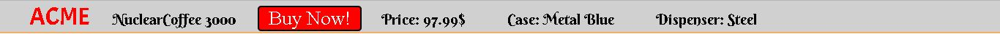
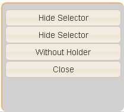
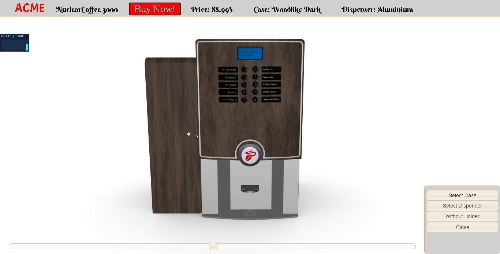
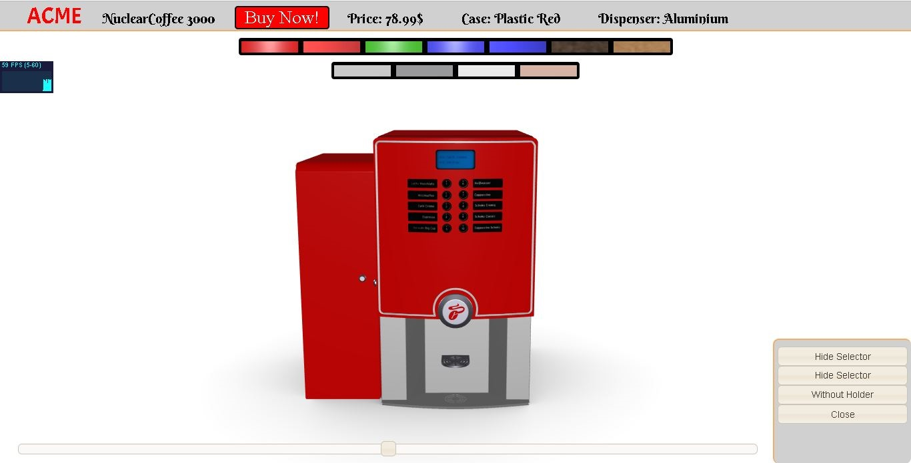
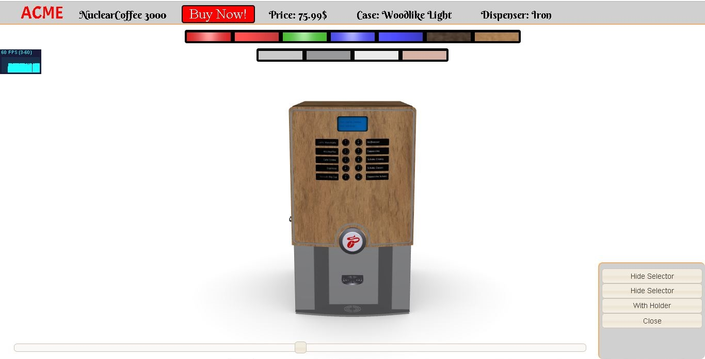
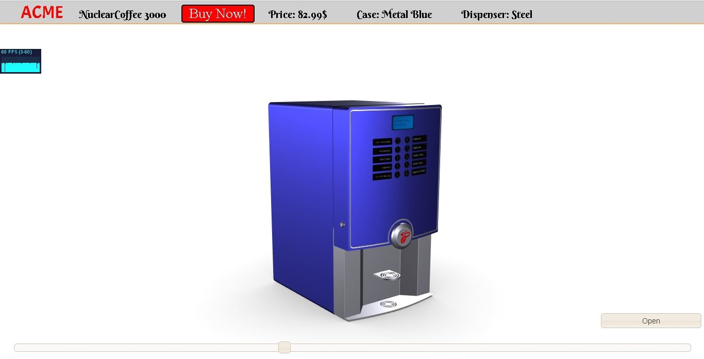

# Second project for the course of Interactive 3D Graphics

### NuclearCoffee3000

This is our project for the Interactive 3D graphics, we created a fragment of an e-commerce site where You can inspect and buy a coffee mahcine.

NuclearCoffee3000 is the newest type of coffee brewing machine, it is highly cuscomizable and it comes in many colors and materials.

You can get the machine with or without the annex coffe holder.

## Membri del gruppo

- Comuzzo Massimo, Matricola 131100

- Rovere Andrea, Matricola 128074

## Descrizione generale del progetto

Il progetto consiste in una applicazione web caratterizzata da un sito di e-commerce che permette l'acquisto di una macchientta del caffè, abbiamo introdotto anche la possibilità di selezionare il materiale per il case e il materiale per il dispenser da una lista di materiali disponibili, è inoltre possibile ruotare la camera attorno alla macchinetta per osservare il prodotto da diverse angolazioni, è inoltre possibile avvicinare o allontanare la camera per concentrarsi sui dettagli o avere una vista d'insieme.

Il progetto consiste nel front-end di una porzione di un sito di e-commerce dove è possibile acquistare una macchinetta per fare il caffè.
>>>>>>> 

L'applicazione presenta le seguenti funzionalità:
- La possibilità di selezionare il materiale per il case e il materiale per il dispenser da una lista di materiali disponibili
- La possibilità di visualizzare la macchinetta senza l'armadietto porta caffè dato che è disponibile un' opzione di acquisto che non lo comprende
- La possibilità ruotare la macchinetta per osservare il prodotto da diverse angolazioni
- La possibilità di effettuare uno zoom per guardare i dettagli o per avere una visione d'insieme

I materiali scelti e il prezzo relativo alle opzioni selezionate vengono visualizzati sulla navigation bar in alto.

La pagina web è responsive, di conseguenza le immagine e il testo presente nella pagina vengono ridimensionati automaticamente quando la pagina viene ingrandita o rimpicciolita.

## Suddivisione del codice 

- **index.html** è il file principale che contiene il codice html, gli shaders e il codice Javascript per l'applicazione con l'inizializzazione della scena e il rendering loop 
- **style.css** è il foglio di stile per l'interfaccia utente
- **materials.js** contiene le definizioni dei materiali utilizzati
- **README.md** è questo file che contiene la relazione del progetto
- **journal.md** diario sui progressi del progetto
- la cartella **gui-images** contiene le immagini dell'interfaccia utente
- la cartella **textures** contiene le texture per i materiali Woodlike Dark e Woodlike Light e le ambient occlusion map
- la cartella **jquery-ui** contiene la libreria jQuery UI con le relative immagini e il foglio di stile e la libreria jQuery
- la cartella **fonts** contiene i font utilizzati insieme alle loro licenze
- la cartella **libs** contiene le librerie Javascript utilizzate
- la cartella **models** contiene il modello (nel formato gltf) della macchinetta visualizzata
- la cartella **Screenshot** contiene gli screenshot presenti in questa relazione

## Camera

Nella pagina web è possibile ruotare la macchinetta del caffe tramite uno slider posto nella parte inferiore della pagina, inoltre è possibile effettuare zoom in/out tramite la rotellina del mouse. 

## Interfaccia Utente

Nella parte in alto della pagina web è presente un menù contenente:

- Logo ACME con il riferimento alla pagina home del sito
- Nome del macchinetta del caffè
- Riferimento alla pagina per l'acquisto della macchinetta
- Prezzo della macchinetta
- Nome del materiale selezionato per il case
- Nome del materiale selezionato per il dispenser 

Nella parte destra della pagina web è presente un menù contenente tre pulsanti:

- **Select Case**: premendolo è possibile far comparire un menù per la selezione dei materiali del case della macchinetta; premendolo una seconda volta è possibile nascondere la selezione dei materiali
- **Select Dispenser**: premendolo è possibile far comparire un menù per la selezione dei materiali del case della macchinetta; come il pulsante precedente può essere poi utilizzato per nascondere il menù visualizzato
- **Close**: può essere usato per nascondere il menù cosi da permettere una migliore visualizzazione del prodotto anche su dispositivi che presentano uno schermo di dimensioni ridotte

## Screenshot

## Futuri sviluppi

Alcune possibili estensioni e miglioramenti sono:

- Creare altri materiali
- Creare alcune animazioni come l'erogazione del caffè

## Crediti

- Il modello della macchinetta è preso da: [sketchfab](https://sketchfab.com)
- le texture per i materiali del legno sono prese da: [CC0 textures](https://cc0textures.com)

  