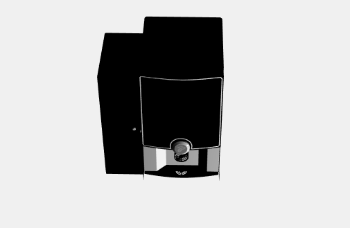

#### 20/05/2019
- Abbiamo guardato diversi modelli a licenza libera e abbiamo selezionato tra questi due modelli, che ci sembravano più idonei al progetto:
    * [una macchinetta per fare il caffè;](https://sketchfab.com/3d-models/maschiene-caffea-compact-v4-922143170e2445c18dde58678fe48c25)
    * [un bersaglio per le freccette.](https://sketchfab.com/3d-models/dart-set-8dc4075c2c764870b45f037dec2032a8)

---

#### 22/05/2019

- Abbiamo deciso di usare il modello della macchinetta da caffè perché ci è sembrato più facile da personalizzare (ad esempio rimuovendo l'armadietto porta caffè) e che permettesse l'utilizzo di una gamma di materiali più ampia.

---

#### 25/05/2019

- Abbiamo trovato una cubemap di una stanza di albergo che potrebbe essere utilizzata come environment map nello shading.

---

#### 26/05/2019

- Abbiamo provato a caricare il modello con GLTF Loader ma abbiamo notato che i pulsanti e il display non venivano renderizzati.

#### Prima versione del modello

---

#### 27/05/2019

- Abbiamo capito che il problema dei pulsanti era dovuto al fatto che essi sono applicati ad una back face del modello e abbiamo risolto il problema modificando l'attributo side del materiale.

---

#### 28/05/2019

- Abbiamo deciso di modificare il modello per migliorare l'estetica della macchinetta.

---

#### 29/05/2019

- Abbiamo aggiunto uno shader microfacet.

---

#### 30/05/2019

- Abbiamo utilizzato lo shader per creare alcuni materiali sia metallici che isolanti da utilizzare per il case e per il dispenser.

---

#### 31/05/2019

- Abbiamo aggiunto uno slider per ruotare la camera attorno alla macchinetta.

- Abbiamo aggiunto la possibilità di fare zoom in/out.

---

#### 04/06/2019

- Abbiamo aggiunto lo shader per un materiale plastico dalle fattezze del legno.

---

#### 05/06/2019

- Abbiamo aggiunto un foglio di stile per una prima versione del layout della pagina e dell'interfaccia utente.

---

#### 07/06/2019

- Abbiamo deciso di aggiungere la possibilità di nascondere interfaccia utente in modo che il modello sia più visualizzabile da dispositivi con schermo di dimensioni ridotte.

---

#### 08/06/2019

- Abbiamo riscontrato un problema quando la pagina viene visualizzata sul browser "Chrome" e siamo riusciti a risolverlo abilitando l'estensione **derivatives** nei materiali che utilizzano una normal map.

---

#### 10/06/2019

- Abbiamo migliorato l'interfaccia utente.
- Abbiamo aggiunto un altro materiale (simil-legno chiaro).
- Abbiamo modificato gli shader per tutti i materiali aggiungendo tre luci.

---

#### 12/06/2019

- Abbiamo implementato una navigation bar.
- Abbiamo migliorato la selezione dei materiali.
- Abbiamo testato uno shader per calcolare una glossy specular reflection utilizzando la environment map ma non eravamo contenti del risultato e quindi abbiamo deciso di utilizzare i materiali sviluppati in precedenza.

---

#### 13/06/2019

- Abbiamo calcolato delle ambient occlusion map per aggiungere le ombre della macchinetta per il caffè.

---

#### 14/06/2019

- Abbiamo aggiunto un piano su cui abbiamo applicato le ombre del modello utilizzando le ambient occlusion map.
- Abbiamo modificato la posizione della camera.

---

#### 15/06/2019

- Abbiamo aggiunto un'opzione che permette la visualizzazione e l'acquisto della macchinetta senza l'armadietto porta caffè.
- Abbiamo ultimato l'interfaccia utente e lo stile grafico dell'applicazione.

---

#### 16/06/2019

- Abbiamo aggiunto un nuovo font.